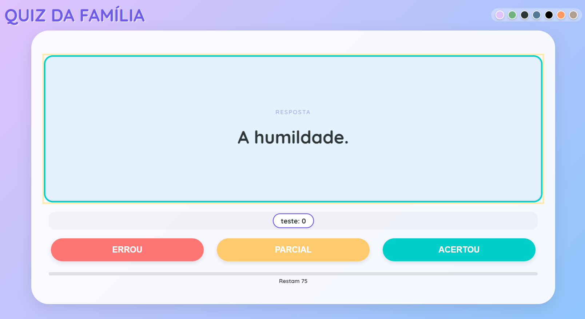

# 🧠 Quiz da Família

Um aplicativo de Quiz interativo, responsivo e instalável (PWA), projetado para gamificar o estudo em família ou reuniões sociais. O jogo transforma uma lista simples de perguntas em uma experiência visual de "Show do Milhão", compatível com celulares, tablets, PCs e Smart TVs.



## ✨ Funcionalidades

* **🕹️ Gamificação Completa:** Adicione jogadores ilimitados, marque pontos e veja o ranking em tempo real.
* **📱 Progressive Web App (PWA):**
  * Instalável como aplicativo nativo no Android, iOS e Desktop.
  * **Funcionamento Offline:** O jogo funciona mesmo sem internet (após o primeiro acesso).
  * **Atualização Inteligente:** Prioriza baixar novas perguntas (CSV) da internet, mas usa o cache se estiver offline.
* **🎨 Temas Visuais:** 7 temas disponíveis (Padrão, Jungle, Cyberpunk, Oceano, Alto Contraste, Crepúsculo e Café) com troca instantânea.
* **📺 Responsividade Total:**
  * Layout adaptativo para Celulares (Retrato/Paisagem).
  * Modo "Tela Cheia" para Tablets e Nest Hubs.
  * Fontes dinâmicas que se ajustam ao tamanho do texto e da tela.
* **🔄 Cartões 3D:** Animação suave de virada de carta (Flip Card) para revelar respostas.
* **⚙️ Customização Fácil:** As perguntas são carregadas de um arquivo `flashcards.csv` simples.

## 🚀 Como Usar

### 1. Preparando as Perguntas

O "banco de dados" do jogo é o arquivo `flashcards.csv`. Para editar:

1. Abra o arquivo `flashcards.csv` em um editor de texto ou Excel.
2. Mantenha o formato: `"Pergunta","Resposta"`.
3. Exemplo:
   ```csv
   "Qual é a capital do Brasil?","Brasília"
   "Quem pintou a Mona Lisa?","Leonardo da Vinci"
   "Quanto é 10 + 10?","20"
   ```
4. Salve o arquivo. Ao abrir o app com internet, ele atualizará automaticamente.

### 2. Jogando

1. Abra o site/app.
2. Digite o nome dos participantes e clique em **ADD**.
3. Clique em **INICIAR JOGO**.
4. Leia a pergunta no cartão.
5. Toque no cartão (ou aperte Enter) para ver a resposta.
6. Marque a pontuação:
   * **ERROU:** 0 pontos.
   * **PARCIAL:** 0.5 ponto.
   * **ACERTOU:** 1 ponto.

## 🛠️ Instalação (PWA)

O projeto é um PWA completo.

* **Android/PC:** Um banner de instalação aparecerá automaticamente. Ou clique no ícone de "Instalar" na barra de endereço do Chrome.
* **iOS (iPhone/iPad):** Toque no botão "Compartilhar" do Safari e selecione "Adicionar à Tela de Início".

## 💻 Estrutura Técnica

O projeto utiliza tecnologias web modernas sem dependência de frameworks pesados (Vanilla JS):

* **HTML5:** Semântico e estruturado.
* **CSS3:**
  * **CSS Variables:** Para gerenciamento de temas (Cores, Fundos).
  * **Flexbox & Grid:** Para layout responsivo.
  * **Media Queries:** Ajustes finos para Nest Hub, Mobile Landscape e TVs.
  * **Clamp()**: Para tipografia fluida.
* **JavaScript (ES6+):**
  * **Fetch API:** Para leitura assíncrona do CSV.
  * **Service Workers (`sw.js`):** Gerenciamento de cache e estratégia *Network-First* para arquivos críticos.
  * **Manifest.json:** Metadados para instalação do app.

## 📂 Estrutura de Arquivos

```text
/
├── index.html       # O código principal do jogo (Lógica + UI)
├── sw.js            # Service Worker (Cérebro do PWA e Cache)
├── manifest.json    # Configurações de instalação do App
└── flashcards.csv   # Banco de perguntas e respostas
```
